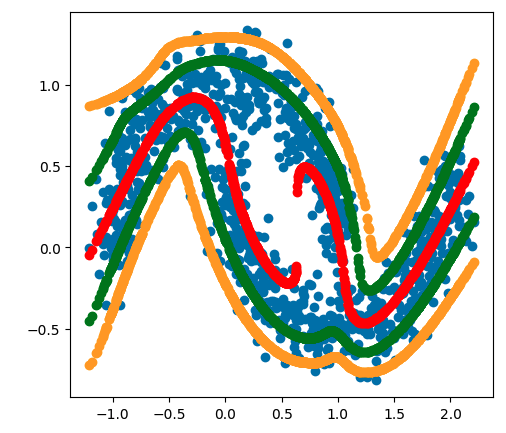

### scikit-mdn

A mixture density network, by PyTorch, for scikit-learn

This project started as part of a live-stream that is part of the [probabl](https://probabl.ai/) outreach effort on [YouTube](https://www.youtube.com/channel/UCIat2Cdg661wF5DQDWTQAmg). If you want to watch the relevant livestreams they can be found [here](https://youtube.com/live/bPcI5bReUMQ) and [here](https://youtube.com/live/K0VY-5GuMCQ). 

### Usage

To get this tool working locally you will first need to install it:

```bash
python -m pip install scikit-mdn
```

Then you can use it in your code. Here is a small demo example.

```python
import numpy as np
import matplotlib.pyplot as plt
from sklearn.datasets import make_moons
from skmdn import MixtureDensityEstimator

# Generate dataset
n_samples = 1000
X_full, _ = make_moons(n_samples=n_samples, noise=0.1)
X = X_full[:, 0].reshape(-1, 1)  # Use only the first column as input
Y = X_full[:, 1].reshape(-1, 1)  # Predict the second column

# Add some noise to Y to make the problem more suitable for MDN
Y += 0.1 * np.random.randn(n_samples, 1)

# Fit the model
mdn = MixtureDensityEstimator()
mdn.fit(X, Y)

# Predict some quantiles on the train set 
means, quantiles = mdn.predict(X, quantiles=[0.01, 0.1, 0.9, 0.99], resolution=100000)
plt.scatter(X, Y)
plt.scatter(X, quantiles[:, 0], color='orange')
plt.scatter(X, quantiles[:, 1], color='green')
plt.scatter(X, quantiles[:, 2], color='green')
plt.scatter(X, quantiles[:, 3], color='orange')
plt.scatter(X, means, color='red')
```

This is what the chart looks like:



### API Documentation

You can find the API documentation on GitHub pages, found here:

https://koaning.github.io/scikit-mdn/

### More depth

If you appreciate a glimpse of the internals, you may want to play around with the `mdn.ipynb` notebook that contains a Jupyter widget.


### Extra resources

- [Original paper by Christopher Bishop](https://publications.aston.ac.uk/id/eprint/373/1/NCRG_94_004.pdf)
